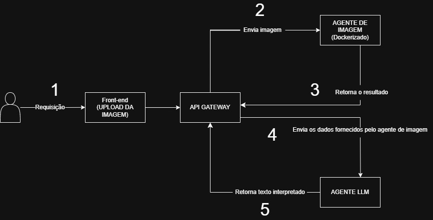

# ☕ Raízes do Café
## Arquitetura Distribuída com API Gateway, Processamento de Imagem e LLM

### 💻 Descrição Geral do Projeto

Este trabalho foi desenvolvido para a disciplina Sistemas Distribuídos da Universidade Federal de Lavras (UFLA). Ele consiste na implementação de uma arquitetura distribuída que integra múltiplos serviços — um API Gateway, um Agente de Processamento de Imagens, um Agente LLM e um Front-End — para analisar imagens de raízes de café e gerar uma interpretação textual automatizada.

A aplicação demonstra na prática conceitos essenciais de sistemas distribuídos: comunicação entre serviços, isolamento por contêineres, orquestração, tolerância a falhas e integração entre componentes heterogêneos.

---

### 📝 Detalhamento da Arquitetura (Fluxo de Trabalho)



O trabalho consiste em desenvolver e integrar os seguintes componentes, conforme ilustrado no diagrama:

1.  **Usuário/Requisição:** O fluxo inicia com uma **Requisição** do usuário.
2.  **Front End (UPLOAD DA IMAGEM):**
    * O usuário interage com o **Front End** para realizar o **UPLOAD DA IMAGEM**.
    * Este componente envia a solicitação para o próximo ponto da arquitetura.
3.  **API GATEWAY (dockerizado):**
    * O **API GATEWAY** atua como o ponto de entrada central para o sistema, recebendo a requisição inicial.
    * Ele orquestra a comunicação:
        * Envia a **Imagem** para o **AGENTE DE IMAGEM**.
        * Recebe o **resultado** do **AGENTE DE IMAGEM**.
        * Envia os **dados fornecidos pelo agente de imagem** para o **AGENTE LLM**.
        * Recebe o **texto interpretado** do **AGENTE LLM**.
        * Retorna a resposta final para o Front End.
4.  **AGENTE DE IMAGEM (dockerizado):**
    * Este componente recebe a imagem enviada pelo *API Gateway*, e retorna as informações de 'Comprimento total estimado', 'Volume estimado' e 'Área das raízes' referentes à imagem de uma raiz de café.
    * Processa a imagem e **Retorna o resultado** para o *API Gateway*.
5.  **AGENTE LLM (dockerizado):**
    * Recebe os dados processados pelo Agente de Imagem através do *API Gateway*.
    * Sua função é gerar o **texto interpretado** com base nos dados de entrada.
    * **Retorna texto interpretado** ao *API Gateway*.

### 🔐 Modelagem de Ameaças

O documento completo da modelagem está disponível em:
[Documento completo da modelagem](./Docs/modelagem_ameacas_sistema_distribuido.ods)

### 🛡️ Mitigação implementada (Ameaça #9 — Armazenamento local inseguro)

Na primeira versão, o Gateway usava:

```multer({ dest: "uploads/" })```

Isso armazenava todas as imagens enviadas no disco do servidor, criando riscos de:
- vazamento de dados sensíveis,
- acúmulo indefinido de arquivos,
- exposição caso o container fosse acessado indevidamente.

### ✔️ Medidas que foram implementadas

1. Remoção total do armazenamento em disco
Agora o upload usa:
```multer.memoryStorage()```, evitando salvar arquivos no servidor.

2. Validação rígida do tipo de arquivo
Apenas PNG e JPEG são aceitos.

3. Limpeza de dados sensíveis após o processamento
```req.file.buffer = null;```
Isso garante que nada seja mantido na memória após a resposta.

4. Remoção de bases64 antes de enviar ao LLM
Para evitar exposição da imagem no pipeline interno.

### 🧱 Visão Final da Arquitetura (após mitigação)
[Visão final da Arquitetura](./Docs/Arquitetura-2.jpg)

### 📌 Relevância do Problema

A análise de raízes de café é uma etapa crítica em pesquisas de produção agrícola, melhoramento genético, avaliação de mudas e estudos de desenvolvimento radicular.
Atualmente, esse processo costuma ser:

- Manual
- Demorado
- Sujeito a variações humanas
- Dependente de especialistas

Automatizar essa análise reduz custos e acelera experimentos.

O projeto busca resolver principalmente:

- A falta de ferramentas automatizadas para análise de parâmetros radiculares.
- O tempo elevado necessário para medir e interpretar manualmente as características das raízes.
- A dificuldade de pesquisadores e produtores em interpretar rapidamente métricas de crescimento.

Assim, o sistema oferece processamento automatizado e interpretação textual através de agentes especializados.

### 📚 Referências

LYNCH, J. P. *Root architecture and plant productivity*. **Plant Physiology**, 109(1), 7–13, 1995.  
GREGORY, P. J. *Plant Roots: Growth, Activity and Interactions with the Soil*. **Wiley-Blackwell**, 2006.  
PIERRET, A., et al. *Root Functional Architecture: A Framework for Modeling the Interplay between Roots and Soil*.   **Plant and Soil**, 283, 7–20, 2005.

---
### 🏃 Execução do Projeto

O projeto inclui o script:
```start.sh```

Ele realiza automaticamente:
- Build dos serviços
- Subida do Docker Compose
- Inicialização do Front-End e agentes

**Para executar:**
```chmod +x start.sh```
```./start.sh```

Após a execução:

- O Front-End sobe em: http://localhost:5500/
- O Gateway responde em: http://localhost:5000/
- Os agentes sobem nas portas configuradas no docker-compose.

---
### 👥 Equipe

- Elian Fernando Simões Costa
- Esther Silva de Magalhães
- Maria Eduarda Ferreira da Silva
- Vitória Christie Amaral Santos

O projeto **Raízes do Café** demonstra, na prática, como uma arquitetura distribuída pode integrar serviços especializados para resolver um problema real no contexto agrícola e científico. A combinação entre processamento de imagem, modelos de linguagem e orquestração via API Gateway possibilita uma solução automatizada, escalável e modular, reduzindo a complexidade de análises radiculares tradicionalmente manuais.

Além de atender aos requisitos técnicos da disciplina de Sistemas Distribuídos, o sistema evidencia a importância da divisão de responsabilidades entre serviços, do isolamento por contêineres e das medidas de segurança aplicadas após a modelagem de ameaças. O resultado é uma aplicação completa, funcional e alinhada às boas práticas de desenvolvimento distribuído.
