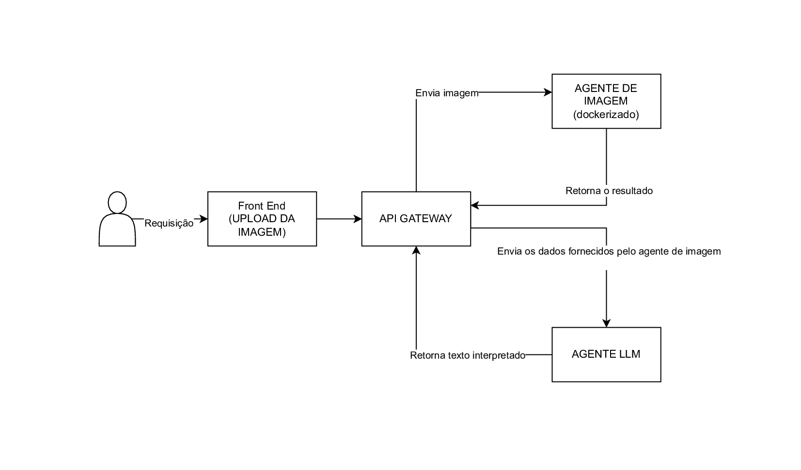

# SD_Raizes_do_Cafe
## 💻 Descrição do Trabalho

Este trabalho é feito para a disciplina de Sistemas Distribuídos da Universidade Federal de Lavras (UFLA), e envolve a criação de uma aplicação que realiza a comunicação entre diferentes serviços em uma Arquitetura Cliente-Servidor Estendida

---

### 📝 Detalhamento da Arquitetura (Fluxo de Trabalho)

O trabalho consiste em desenvolver e integrar os seguintes componentes, conforme ilustrado no diagrama:

1.  **Usuário/Requisição:** O fluxo inicia com uma **Requisição** do usuário.
2.  **Front End (UPLOAD DA IMAGEM):**
    * O usuário interage com o **Front End** para realizar o **UPLOAD DA IMAGEM**.
    * Este componente envia a solicitação para o próximo ponto da arquitetura.
3.  **API GATEWAY (dockerizado):**
    * O **API GATEWAY** atua como o ponto de entrada central para o sistema, recebendo a requisição inicial.
    * Ele orquestra a comunicação:
        * Envia a **Imagem** para o **AGENTE DE IMAGEM**.
        * Recebe o **resultado** do **AGENTE DE IMAGEM**.
        * Envia os **dados fornecidos pelo agente de imagem** para o **AGENTE LLM**.
        * Recebe o **texto interpretado** do **AGENTE LLM**.
        * Retorna a resposta final para o Front End.
4.  **AGENTE DE IMAGEM (dockerizado):**
    * Este componente recebe a imagem enviada pelo *API Gateway*.
    * Processa a imagem e **Retorna o resultado** para o *API Gateway*.
5.  **AGENTE LLM (dockerizado):**
    * Recebe os dados processados pelo Agente de Imagem através do *API Gateway*.
    * Sua função é gerar o **texto interpretado** com base nos dados de entrada.
    * **Retorna texto interpretado** ao *API Gateway*.

---

Este trabalho prático de graduação, a ser realizado por um grupo de quatro discentes, exige a implementação de uma arquitetura complexa que integra front-end, serviços de gateway, e agentes de processamento especializados, aplicando diretamente os conceitos de **Sistemas Distribuídos** para resolver um problema que envolve **Inteligência Artificial (LLM) e Visão Computacional**.

Gostaria de um detalhamento de como seria o desenvolvimento do componente **API GATEWAY**?
